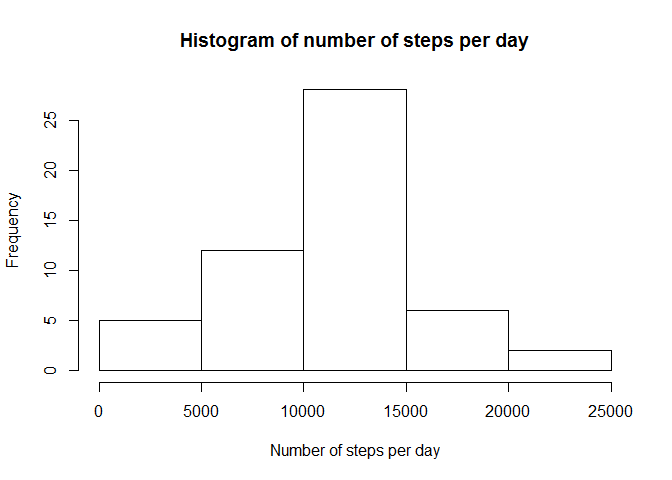
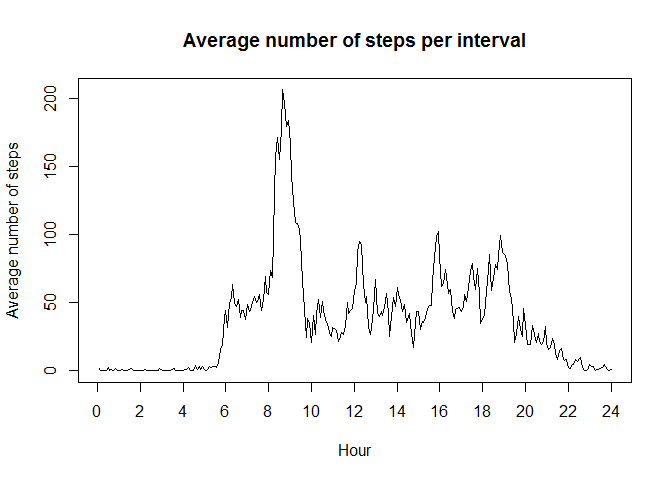
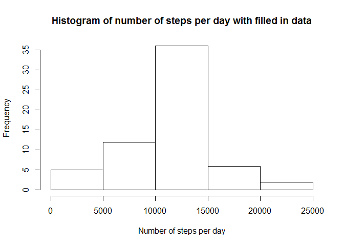
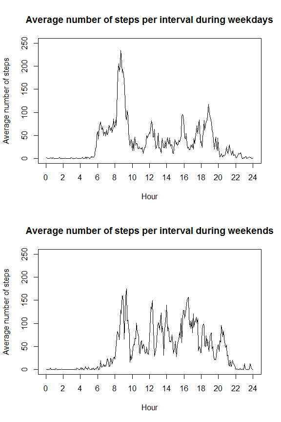

# Reproducible Research: Peer Assessment 1


## Loading and preprocessing the data


```r
activity <- read.csv2(unz("activity.zip", "activity.csv"), sep=",")
```


## What is mean total number of steps taken per day?

Total number of steps per day:


```r
stepsPerDay <- aggregate(steps ~ date, activity, sum)
hist(stepsPerDay$steps, main="Histogram of number of steps per day", xlab="Number of steps per day")
```

<!-- -->

Mean of the total number of steps per day:


```r
mean(stepsPerDay$steps)
```

```
## [1] 10766.19
```

Median of the total number of steps per day:


```r
median(stepsPerDay$steps)
```

```
## [1] 10765
```


## What is the average daily activity pattern?


```r
averageStepsPerInterval <- aggregate(steps ~ interval, activity, mean)
plot(averageStepsPerInterval$steps, type="l", xaxt = "n", xlab="Hour", ylab="Average number of steps", main="Average number of steps per interval")
axis(1, at=seq(0, 288, 24), labels=seq(0, 24, 2))
```

<!-- -->


Maximum number of steps was taken in the 5 minutes interval starting at:


```r
averageStepsPerInterval$interval[which.max(averageStepsPerInterval$steps)]
```

```
## [1] 835
```


## Imputing missing values

Number of NA values:


```r
sum(is.na(activity$steps))
```

```
## [1] 2304
```

Filling the missing values with the average 5 minutes interval values:


```r
activityFilledIn <- activity
for (i in 1:length(activityFilledIn$steps)) {
  if (is.na(activityFilledIn$steps[i])) {
    activityFilledIn$steps[i] <- averageStepsPerInterval$steps[i %% 288 + 1]
  }
}
```

Total number of steps per day with filled in missing data:


```r
stepsPerDayFilledIn <- aggregate(steps ~ date, activityFilledIn, sum)
hist(stepsPerDayFilledIn$steps, main="Histogram of number of steps per day with filled in data", xlab="Number of steps per day")
```

<!-- -->

Mean of the total number of steps per day with filled in missing data:


```r
mean(stepsPerDayFilledIn$steps)
```

```
## [1] 10766.19
```

Median of the total number of steps per day with filled in missing data:


```r
median(stepsPerDayFilledIn$steps)
```

```
## [1] 10766.19
```

The means of the original and the imputed version remained the same. The mean and the median became equal in the imputed version. In the histogram the middle bar became a little bit higher.


## Are there differences in activity patterns between weekdays and weekends?

Setting weekday as factor:


```r
Sys.setlocale("LC_TIME", "English")
```

```
## [1] "English_United States.1252"
```

```r
weekdayFactor <- factor(weekdays(as.Date(activity$date)) %in% c('Monday', 'Tuesday', 'Wednesday', 'Thursday', 'Friday'), levels=c(FALSE, TRUE), labels=c('weekend', 'weekday'))
```


Difference between average number of steps in 5 minutes interval during weekdays and weekend:


```r
averageStepsPerIntervalWeekday <- aggregate(steps ~ interval, activity[weekdayFactor=="weekday",], mean)
averageStepsPerIntervalWeekend <- aggregate(steps ~ interval, activity[weekdayFactor=="weekend",], mean)
par(mfrow=c(2,1))
plot(averageStepsPerIntervalWeekday$steps, type="l", xaxt = "n", xlab="Hour", ylab="Average number of steps", main="Average number of steps per interval during weekdays", ylim=c(0, 250))
axis(1, at=seq(0, 288, 24), labels=seq(0, 24, 2))
plot(averageStepsPerIntervalWeekend$steps, type="l", xaxt = "n", xlab="Hour", ylab="Average number of steps", main="Average number of steps per interval during weekends", ylim=c(0, 250))
axis(1, at=seq(0, 288, 24), labels=seq(0, 24, 2))
```

<!-- -->

```r
par(mfrow=c(1,1))
```
